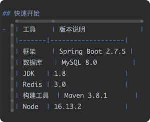

# 通用后台管理系统

## 说明
通用后台管理系统基于ruoyi V3.8.8系统版本改造. 适配一般项目情况.

- 采用了前后端分离的单体架构设计
- 软件环境: JDK、MYSQL、Redis、Maven、Node
- 技术选型: Spring Boot, Spring Security, MyBatis, Jwt, Vue3, Element-Plus
 
## 快速开始
- | 工具    | 版本说明              |
  |-------|-------------------|
  | 框架    | Spring Boot 2.7.5 |
  | 数据库   | MySQL 8.0         |
  | JDK   | 1.8               |
  | Redis | 3.0               |
  | 构建工具  | Maven 3.8.1       |
  | Node  | 16.13.2           |

