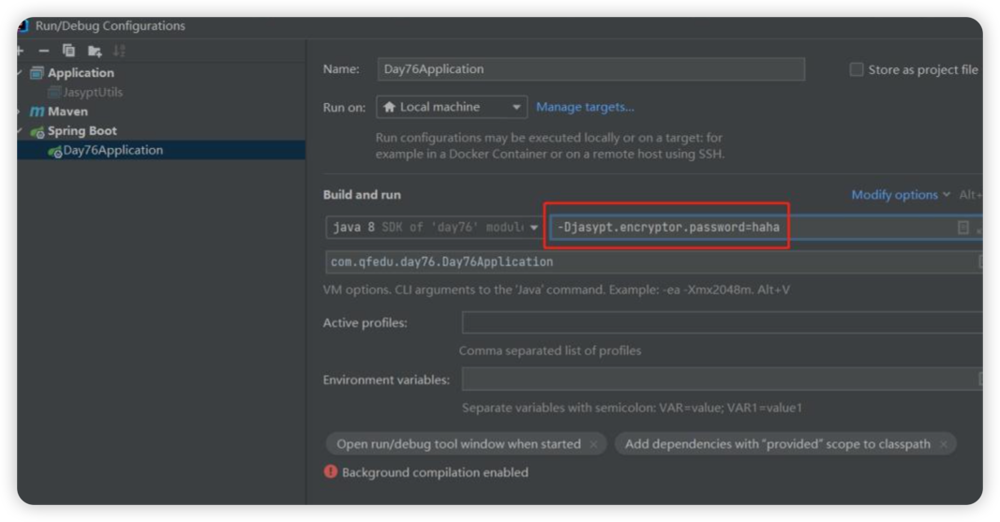

# 使用jasypt对配置文件进行加密.

## 添加依赖
```xml
    <!-- 引入加密插件 -->
    <dependency>
        <groupId>com.github.ulisesbocchio</groupId>
        <artifactId>jasypt-spring-boot-starter</artifactId>
        <version>3.0.5</version>
    </dependency>
```

在yaml里面进行jasypt配置
```yaml
jasypt:
  encryptor:
    # 加密的秘钥
    password: asdqwe123
    # 加密算法
    algorithm: PBEWithMD5AndDES
    iv-generator-classname: org.jasypt.iv.NoIvGenerator
    property:
      # 算法识别的前后缀，默认ENC()，包含在前后缀的加密信息，会使用指定算法解密
      prefix: ENC(
      suffix: )
```
注意这里的密钥不要泄漏 实际项目中密钥应该由运维人员配置，不要提交到git仓库中。
因为这里是测试环境，所以直接写死密钥了。


利用此工具方法. 创建需要的密码.
```java
package com.uni.common.utils;

import org.jasypt.encryption.pbe.StandardPBEStringEncryptor;
import org.jasypt.encryption.pbe.config.EnvironmentStringPBEConfig;

public class JasyptUtils {
    public static void main(String[] args) {
        String info = encrypt("mysqlPassword");
        System.out.println(info);
        System.out.println(decrypt("HW1acinBHA1WBVGkyeSTLGypgc33srrr"));
    }

    /**
     * 加密
     *
     * @param plaintext 明文
     * @return
     */
    public static String encrypt(String plaintext) {
        StandardPBEStringEncryptor encryptor = new StandardPBEStringEncryptor();
        EnvironmentStringPBEConfig config = new EnvironmentStringPBEConfig();
        // 指定算法
        config.setAlgorithm("PBEWithMD5AndDES");
        // 指定秘钥，和yml配置文件中保持一致
        config.setPassword("asdqwe123");
        encryptor.setConfig(config);
        // 生成加密数据
        return encryptor.encrypt(plaintext);
    }

    /**
     * 解密
     *
     * @param data 加密后数据
     * @return
     */
    public static String decrypt(String data) {
        StandardPBEStringEncryptor encryptor = new StandardPBEStringEncryptor();
        EnvironmentStringPBEConfig config = new EnvironmentStringPBEConfig();
        config.setAlgorithm("PBEWithMD5AndDES");
        config.setPassword("asdqwe123");
        encryptor.setConfig(config);
        // 解密数据
        return encryptor.decrypt(data);
    }
}

```

将得到的加密密钥回填到yaml配置文件中即可.
```yaml

```

将加密密码以明文形式写在配置文件中并不安全，实际开发中也不推荐这样使用。我们使用idea测试时，可以进行如下设置：


如果打包后部署项目，可以使用如下命令在启动项目时指定秘钥：

#方式1：
java -jar xxx.jar -Djasypt.encryptor.password=加密数据的秘钥

#方式2：
java -jar xxx.jar --jasypt.encryptor.password=加密数据的秘钥